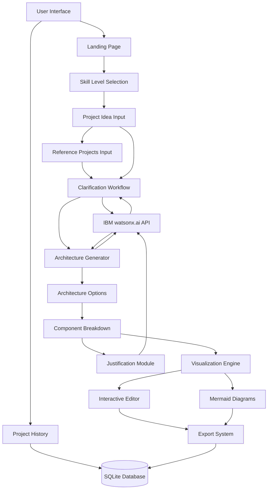

# AI-Powered System Design Assistant - Architecture Plan

## Project Overview

An intelligent web application that transforms rough project ideas into structured, visualized software architectures with IBM watsonx.ai integration. The system adapts explanations and recommendations based on developer skill level (Beginner, Intermediate, Advanced).

## Technology Stack

### Frontend
- **Framework**: Next.js 14+ with App Router
- **Language**: TypeScript
- **UI Library**: React 18+
- **Styling**: Tailwind CSS
- **Visualization**: 
  - Mermaid.js for AI-generated diagrams
  - React Flow for interactive editing
- **State Management**: React Context + Zustand

### Backend
- **Runtime**: Node.js (Next.js API Routes)
- **AI Integration**: IBM watsonx.ai SDK
- **Database**: SQLite with better-sqlite3
- **Validation**: Zod for schema validation

### Development Tools
- **Package Manager**: npm/pnpm
- **Linting**: ESLint + Prettier
- **Testing**: Jest + React Testing Library
- **Version Control**: Git

## System Architecture



## Core Components

### 1. Landing & Onboarding Flow

**Purpose**: Capture initial project idea and user context

**Components**:
- Welcome screen with value proposition
- Skill level selector (Beginner/Intermediate/Advanced)
- Project idea input form with examples
- Quick start guide

**Data Flow**:
```
User Input → Validation → Session Creation → Clarification Phase
```
### 1.5. Reference Projects Input (NEW)

**Purpose**: Capture user preferences through concrete examples of similar projects

**Components**:
- URL input for existing projects (GitHub, live sites, etc.)
- Like/dislike feedback fields
- Features to emulate/avoid specification
- Optional metadata extraction from URLs

**Data Flow**:
```
URL Input → Validation → Optional Metadata Fetch → Store Preferences → Enhance AI Context
```

**Key Features**:
- Multiple reference projects support
- Smart suggestions for common likes/dislikes
- Quick-add buttons for common patterns
- Optional GitHub API integration for metadata
- Visual preview of referenced projects

**Benefits**:
- Reduces clarification questions needed
- Provides concrete examples for AI to learn from
- Generates more personalized architecture options
- Helps users articulate preferences clearly


### 2. AI-Powered Clarification Engine

**Purpose**: Refine vague ideas through intelligent questioning

**Key Features**:
- Dynamic question generation based on project type
- Context-aware follow-ups using conversation history
- Skill-level appropriate language
- Progress tracking (e.g., "3 of 5 questions answered")

**IBM watsonx.ai Integration**:
```typescript
// Prompt structure for clarification
const clarificationPrompt = {
  role: "system",
  content: `You are Bob, an experienced technical leader helping a ${skillLevel} developer 
  refine their project idea: "${projectIdea}". Ask ONE specific clarifying question about:
  - Target users and use cases
  - Scale and performance requirements
  - Technology constraints
  - Integration needs
  - Timeline and resources`
}
```

**Conversation Flow**:
1. Initial idea submission
2. AI generates first clarifying question
3. User responds
4. AI analyzes response, asks follow-up (max 5-7 questions)
5. AI summarizes refined requirements
6. User confirms or requests modifications

### 3. Architecture Options Generator

**Purpose**: Propose multiple architectural approaches with tradeoffs

**Generation Strategy**:
- Analyze refined requirements
- Consider skill level for complexity
- Generate 2-3 distinct architecture options
- Each option includes:
  - High-level overview
  - Technology stack recommendations
  - Deployment strategy
  - Scalability approach
  - Cost implications

**Example Options**:
- **Option A**: Monolithic (simpler, faster to build)
- **Option B**: Microservices (scalable, complex)
- **Option C**: Serverless (cost-effective, vendor lock-in)

### 4. Component Breakdown System

**Purpose**: Decompose architecture into manageable components

**Breakdown Levels**:
- **Beginner**: 3-5 high-level components with simple explanations
- **Intermediate**: 5-8 components with technical details
- **Advanced**: 8-12+ components with design patterns and best practices

**Component Details**:
- Name and purpose
- Responsibilities
- Technology recommendations
- Dependencies and interfaces
- Implementation complexity
- Estimated effort

### 5. Visualization Engine

**Purpose**: Generate and display architecture diagrams

**Mermaid.js Integration**:
- AI generates Mermaid syntax from architecture
- Automatic diagram rendering
- Support for multiple diagram types:
  - System architecture (graph)
  - Sequence diagrams (interactions)
  - Entity relationships (data models)
  - Deployment diagrams (infrastructure)

**React Flow Integration**:
- Convert Mermaid to interactive nodes
- Drag-and-drop editing
- Add/remove components
- Modify connections
- Export modified diagrams

**Diagram Generation Flow**:
```
Architecture Data → AI Prompt → Mermaid Syntax → Render → Interactive Editor
```

### 6. Decision Justification Module

**Purpose**: Explain architectural choices and tradeoffs

**Justification Categories**:
- **Technology Choices**: Why specific frameworks/tools
- **Architectural Patterns**: Why this structure
- **Scalability Decisions**: How it handles growth
- **Security Considerations**: Built-in protections
- **Cost Implications**: Budget impact
- **Maintenance Burden**: Long-term effort

**Skill-Level Adaptation**:
- **Beginner**: Simple analogies, avoid jargon
- **Intermediate**: Technical terms with explanations
- **Advanced**: Deep technical analysis, alternatives

### 7. Project Persistence Layer

**Purpose**: Store and retrieve project sessions

**Database Schema**:
```sql
-- Projects table
CREATE TABLE projects (
  id TEXT PRIMARY KEY,
  title TEXT NOT NULL,
  skill_level TEXT NOT NULL,
  initial_idea TEXT NOT NULL,
  refined_requirements TEXT,
  selected_architecture TEXT,
  created_at DATETIME DEFAULT CURRENT_TIMESTAMP,
  updated_at DATETIME DEFAULT CURRENT_TIMESTAMP
);

-- Conversations table
CREATE TABLE conversations (
  id TEXT PRIMARY KEY,
  project_id TEXT NOT NULL,
  role TEXT NOT NULL, -- 'user' or 'assistant'
  content TEXT NOT NULL,
  timestamp DATETIME DEFAULT CURRENT_TIMESTAMP,
  FOREIGN KEY (project_id) REFERENCES projects(id)
);

-- Architectures table
CREATE TABLE architectures (
  id TEXT PRIMARY KEY,
  project_id TEXT NOT NULL,
  option_name TEXT NOT NULL,
  description TEXT,
  components TEXT, -- JSON
  diagram_mermaid TEXT,
  diagram_reactflow TEXT, -- JSON
  justifications TEXT, -- JSON
  created_at DATETIME DEFAULT CURRENT_TIMESTAMP,
  FOREIGN KEY (project_id) REFERENCES projects(id)
);
```

### 8. Export System

**Purpose**: Allow users to save and share their architectures

**Export Formats**:
- **Markdown**: Complete documentation with diagrams
- **PDF**: Professional presentation format
- **JSON**: Machine-readable for import
- **PNG/SVG**: Diagram images
- **Mermaid**: Raw diagram syntax

**Export Contents**:
- Project overview
- Refined requirements
- Selected architecture option
- Component breakdown
- Diagrams (embedded)
- Decision justifications
- Implementation roadmap

## User Journey

### Phase 1: Idea Submission
1. User lands on homepage
2. Selects skill level
3. Enters rough project idea
4. Clicks "Start Design Process"

### Phase 2: Clarification
1. AI asks first clarifying question
2. User responds
3. AI asks follow-up questions (iterative)
4. AI presents refined requirements summary
5. User confirms or requests changes

### Phase 3: Architecture Generation
1. AI generates 2-3 architecture options
2. Each option shows:
   - Overview diagram
   - Key components
   - Technology stack
   - Pros and cons
3. User selects preferred option

### Phase 4: Detailed Design
1. System shows detailed component breakdown
2. Interactive Mermaid diagram displayed
3. User can edit in React Flow
4. Justifications for each decision shown
5. Tradeoffs explained

### Phase 5: Export & Save
1. User reviews complete architecture
2. Can export in multiple formats
3. Project saved to history
4. Can return to edit later

## IBM watsonx.ai Integration Strategy

### API Configuration
```typescript
// config/watsonx.ts
import { WatsonXAI } from '@ibm-cloud/watsonx-ai';

export const watsonxClient = new WatsonXAI({
  version: '2024-05-31',
  serviceUrl: process.env.WATSONX_URL,
  apikey: process.env.WATSONX_API_KEY,
  projectId: process.env.WATSONX_PROJECT_ID,
});
```

### Prompt Engineering

**Clarification Prompts**:
- Role: Technical advisor (Bob persona)
- Context: Project idea + skill level
- Task: Ask ONE specific question
- Constraints: Keep questions focused and actionable

**Architecture Generation Prompts**:
- Role: Senior architect
- Context: Refined requirements + skill level
- Task: Generate 2-3 distinct options
- Output: Structured JSON with components

**Justification Prompts**:
- Role: Technical educator
- Context: Selected architecture + skill level
- Task: Explain decisions and tradeoffs
- Style: Adapt to skill level

### Model Selection
- **Primary Model**: IBM Granite or Llama 3
- **Temperature**: 0.7 for creative options, 0.3 for technical accuracy
- **Max Tokens**: 2000-4000 depending on task

## Key Design Decisions

### 1. Why Next.js?
**Decision**: Use Next.js App Router with server components

**Justification**:
- Single codebase for frontend and backend
- API routes for watsonx.ai integration
- Server-side rendering for better performance
- Built-in optimization (images, fonts, etc.)
- Easy deployment to Vercel or IBM Cloud

**Tradeoffs**:
- Learning curve for App Router
- Server components require careful state management
- Alternative: Separate React + Express would give more flexibility but increase complexity

### 2. Why SQLite?
**Decision**: Use SQLite for project persistence

**Justification**:
- Zero configuration database
- File-based, easy to backup
- Sufficient for single-user or small team usage
- No separate database server needed
- Fast for read-heavy workloads

**Tradeoffs**:
- Not suitable for high concurrency
- Limited to single server deployment
- Alternative: PostgreSQL would scale better but adds infrastructure complexity

### 3. Why Mermaid.js + React Flow?
**Decision**: Combine both visualization libraries

**Justification**:
- Mermaid: Easy for AI to generate text-based diagrams
- React Flow: Provides interactive editing capabilities
- Best of both worlds: AI generation + human refinement

**Tradeoffs**:
- Two libraries increase bundle size
- Need conversion layer between formats
- Alternative: D3.js would be more flexible but harder to generate from AI

### 4. Why Three Skill Levels?
**Decision**: Beginner, Intermediate, Advanced

**Justification**:
- Simple enough for users to self-identify
- Meaningful differences in explanation depth
- Covers most use cases without overwhelming choice

**Tradeoffs**:
- Less granular than 5 levels
- Some users may fall between categories
- Alternative: Dynamic assessment would be more accurate but slower

## Implementation Roadmap

### Sprint 1: Foundation (Week 1)
- Set up Next.js project
- Configure TypeScript and tooling
- Set up IBM watsonx.ai credentials
- Create basic UI layout
- Initialize SQLite database

### Sprint 2: Core Flow (Week 2)
- Build landing page and skill selection
- Implement idea input form
- Create clarification workflow
- Integrate watsonx.ai for questions
- Build conversation interface

### Sprint 3: Architecture Generation (Week 3)
- Implement architecture options generator
- Create component breakdown system
- Build Mermaid diagram generation
- Add React Flow integration
- Implement justification module

### Sprint 4: Persistence & Export (Week 4)
- Complete database integration
- Build project history feature
- Implement export functionality
- Add responsive design
- Write documentation

### Sprint 5: Testing & Deployment (Week 5)
- End-to-end testing
- Performance optimization
- Security review
- Deploy to production
- User acceptance testing

## Success Metrics

### User Experience
- Time from idea to architecture: < 10 minutes
- User satisfaction: > 4/5 stars
- Completion rate: > 80% of started sessions

### Technical Performance
- Page load time: < 2 seconds
- AI response time: < 5 seconds per question
- Diagram generation: < 3 seconds
- Export generation: < 5 seconds

### Quality Metrics
- Architecture relevance: Validated by expert review
- Explanation clarity: Tested with target skill levels
- Diagram accuracy: Matches described architecture

## Risk Mitigation

### Risk 1: watsonx.ai API Limits
**Mitigation**: 
- Implement request caching
- Add rate limiting
- Provide fallback responses
- Monitor usage closely

### Risk 2: Complex Diagram Generation
**Mitigation**:
- Start with simple diagram types
- Validate Mermaid syntax before rendering
- Provide manual editing fallback
- Test with various project types

### Risk 3: Skill Level Mismatch
**Mitigation**:
- Allow users to change skill level mid-session
- Provide examples for each level
- Add feedback mechanism
- A/B test explanation styles

### Risk 4: Database Scalability
**Mitigation**:
- Design schema for easy migration to PostgreSQL
- Implement data archival strategy
- Monitor database size
- Plan for cloud database upgrade path

## Future Enhancements

### Phase 2 Features
- User authentication and accounts
- Team collaboration features
- Version control for architectures
- Template library for common patterns
- Integration with project management tools

### Phase 3 Features
- Code generation from architecture
- Cost estimation calculator
- Security vulnerability scanning
- Performance prediction modeling
- Multi-language support

### Phase 4 Features
- AI-powered code review
- Automated testing strategy generation
- Deployment pipeline recommendations
- Monitoring and observability setup
- Documentation generation

## Conclusion

This architecture provides a solid foundation for an AI-powered system design assistant that:
- Guides users through structured design thinking
- Adapts to different skill levels
- Produces professional, justified architectures
- Enables interactive refinement
- Supports project persistence and export

The modular design allows for incremental development and future enhancements while maintaining a clear separation of concerns and scalability path.