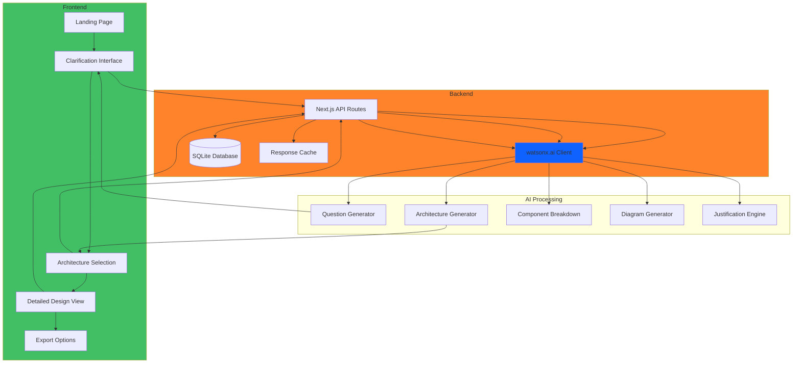

# Planning Summary - AI-Powered System Design Assistant

## Executive Summary

This document provides a comprehensive overview of the planning phase for building an AI-powered system design assistant that transforms rough project ideas into structured, visualized software architectures using IBM watsonx.ai.

## Project Vision

**Goal**: Create an intelligent web application that guides developers through a conversational design process, adapting to their skill level (Beginner, Intermediate, Advanced) to produce professional, justified system architectures.

**Target Users**: 
- Junior developers learning system design
- Mid-level developers exploring architecture options
- Senior developers seeking quick architecture validation
- Technical leads planning new projects

## Core Value Proposition

1. **Reduces Time**: From hours/days of research to 10 minutes of guided conversation
2. **Improves Quality**: AI-powered best practices and pattern recognition
3. **Educates**: Skill-level adapted explanations teach while designing
4. **Visualizes**: Interactive diagrams make complex systems understandable
5. **Documents**: Auto-generated professional documentation

## Key Design Decisions

### 1. Technology Stack: Next.js Full-Stack

**Decision**: Use Next.js 14+ with App Router

**Rationale**:
- Single codebase for frontend and backend
- Built-in API routes for watsonx.ai integration
- Server-side rendering for performance
- Easy deployment to Vercel or IBM Cloud
- Excellent TypeScript support

**Alternatives Considered**:
- React + Node.js (more complex, better for microservices)
- Python FastAPI + React (team Python expertise required)

### 2. AI Provider: IBM watsonx.ai

**Decision**: Use IBM watsonx.ai with Granite and Llama models

**Rationale**:
- Enterprise-grade AI capabilities
- Multiple model options for different tasks
- Strong technical content generation
- IBM Cloud integration
- Hackathon alignment

**Model Strategy**:
- Granite-13b-chat: Conversational clarification
- Llama-3-70b: Complex architecture generation
- Granite-20b-code: Technical diagram generation

### 3. Visualization: Mermaid.js + React Flow

**Decision**: Combine both libraries

**Rationale**:
- Mermaid: Easy for AI to generate text-based diagrams
- React Flow: Interactive editing for user refinement
- Best of both: AI generation + human customization

**Alternatives Considered**:
- D3.js only (too complex for AI generation)
- React Flow only (harder for AI to generate)

### 4. Persistence: SQLite

**Decision**: Use SQLite for project storage

**Rationale**:
- Zero configuration
- File-based, easy backup
- Sufficient for single-user/small team
- Fast for read-heavy workloads
- No separate database server

**Migration Path**: Schema designed for easy PostgreSQL migration if needed

### 5. Skill Levels: Three Tiers

**Decision**: Beginner, Intermediate, Advanced

**Rationale**:
- Simple for users to self-identify
- Meaningful differences in explanation depth
- Covers most use cases
- Not overwhelming

**Adaptation Strategy**:
- Beginner: Simple language, analogies, 3-5 components
- Intermediate: Technical terms with explanations, 5-8 components
- Advanced: Deep analysis, best practices, 8-12+ components

## System Architecture Overview



## User Flow Design

### Phase 1: Onboarding (30 seconds)
1. User lands on homepage
2. Sees value proposition and examples
3. Selects skill level
4. Enters project idea (50-500 words)
5. Clicks "Start Design Process"

### Phase 2: Clarification (3-5 minutes)
1. AI asks first clarifying question
2. User responds (text input)
3. AI analyzes and asks follow-up
4. Repeat 5-7 times
5. AI presents refined requirements
6. User confirms or requests changes

### Phase 3: Architecture Options (2-3 minutes)
1. AI generates 2-3 distinct options
2. User reviews each option:
   - Overview diagram
   - Tech stack
   - Pros and cons
   - Complexity rating
   - Cost estimate
3. User selects preferred option

### Phase 4: Detailed Design (3-5 minutes)
1. System shows component breakdown
2. Interactive Mermaid diagram
3. User can edit in React Flow
4. Justifications displayed
5. Tradeoffs explained
6. User reviews and refines

### Phase 5: Export (1 minute)
1. User selects export format
2. System generates documentation
3. User downloads files
4. Project saved to history

**Total Time**: ~10 minutes from idea to complete architecture

## API Design Summary

### Core Endpoints

1. **POST /api/projects** - Create new project
2. **GET /api/projects/:id** - Get project details
3. **POST /api/clarify** - Get next question
4. **POST /api/clarify/complete** - Finalize requirements
5. **POST /api/architecture/generate** - Generate options
6. **POST /api/architecture/select** - Select and expand option
7. **GET /api/architecture/:id/components** - Get components
8. **GET /api/architecture/:id/justifications** - Get justifications
9. **POST /api/diagrams/generate** - Generate diagrams
10. **POST /api/export** - Export project

### Data Flow

```
User Input → Validation → watsonx.ai → Processing → Database → Response
     ↓                                                    ↓
  Cache Check                                      Cache Store
```

## Database Schema Summary

### Tables

1. **projects**: Core project information
2. **conversations**: Chat history
3. **architectures**: Generated architecture options
4. **exports**: Export history and files

### Relationships

```
projects (1) ──→ (many) conversations
projects (1) ──→ (many) architectures
projects (1) ──→ (many) exports
```

## Implementation Phases

### Phase 1: Foundation (Week 1)
**Goal**: Set up project infrastructure

**Tasks**:
- Initialize Next.js with TypeScript
- Configure Tailwind CSS
- Set up IBM watsonx.ai credentials
- Create database schema
- Build basic UI layout

**Deliverables**:
- Working Next.js app
- Database initialized
- watsonx.ai connection tested

### Phase 2: Core Flow (Week 2)
**Goal**: Implement clarification workflow

**Tasks**:
- Build landing page
- Create skill level selector
- Implement conversation interface
- Integrate watsonx.ai for questions
- Store conversations in database

**Deliverables**:
- Functional clarification workflow
- Requirements summary generation
- Conversation persistence

### Phase 3: Architecture Generation (Week 3)
**Goal**: Generate and display architecture options

**Tasks**:
- Implement architecture generator
- Create component breakdown system
- Build Mermaid diagram generation
- Add React Flow integration
- Implement justification module

**Deliverables**:
- Multiple architecture options
- Interactive diagrams
- Decision justifications

### Phase 4: Persistence & Export (Week 4)
**Goal**: Complete data management and export

**Tasks**:
- Finish database integration
- Build project history view
- Implement export functionality
- Add responsive design
- Write user documentation

**Deliverables**:
- Full project persistence
- Export in multiple formats
- Responsive UI
- User guide

### Phase 5: Testing & Deployment (Week 5)
**Goal**: Ensure quality and deploy

**Tasks**:
- End-to-end testing
- Performance optimization
- Security review
- Deploy to production
- User acceptance testing

**Deliverables**:
- Production-ready application
- Test coverage > 80%
- Deployed to IBM Cloud/Vercel
- Performance benchmarks met

## Risk Assessment & Mitigation

### High Priority Risks

#### 1. watsonx.ai API Reliability
**Risk**: API downtime or rate limits
**Impact**: Application unusable
**Mitigation**:
- Implement retry logic with exponential backoff
- Cache common responses
- Provide fallback responses
- Monitor usage closely

#### 2. Diagram Generation Quality
**Risk**: AI generates invalid Mermaid syntax
**Impact**: Broken visualizations
**Mitigation**:
- Validate Mermaid syntax before rendering
- Provide manual editing fallback
- Test with diverse project types
- Use structured prompts

#### 3. Skill Level Mismatch
**Risk**: Explanations too complex or too simple
**Impact**: Poor user experience
**Mitigation**:
- Allow mid-session skill level changes
- Provide examples for each level
- A/B test explanation styles
- Gather user feedback

### Medium Priority Risks

#### 4. Database Scalability
**Risk**: SQLite limitations at scale
**Impact**: Performance degradation
**Mitigation**:
- Design for PostgreSQL migration
- Implement data archival
- Monitor database size
- Plan upgrade path

#### 5. Export Generation Performance
**Risk**: Slow export for large projects
**Impact**: User frustration
**Mitigation**:
- Generate exports asynchronously
- Show progress indicators
- Optimize file generation
- Cache generated exports

## Success Criteria

### User Experience Metrics
- ✅ Time from idea to architecture: < 10 minutes
- ✅ User satisfaction rating: > 4/5 stars
- ✅ Session completion rate: > 80%
- ✅ Return user rate: > 40%

### Technical Performance Metrics
- ✅ Page load time: < 2 seconds
- ✅ AI response time: < 5 seconds
- ✅ Diagram generation: < 3 seconds
- ✅ Export generation: < 5 seconds

### Quality Metrics
- ✅ Architecture relevance: Expert validated
- ✅ Explanation clarity: Tested per skill level
- ✅ Diagram accuracy: Matches architecture
- ✅ Test coverage: > 80%

## Cost Estimation

### Development Costs
- **Phase 1-2**: 2 weeks × 40 hours = 80 hours
- **Phase 3-4**: 2 weeks × 40 hours = 80 hours
- **Phase 5**: 1 week × 40 hours = 40 hours
- **Total**: 200 hours

### Infrastructure Costs (Monthly)
- **IBM watsonx.ai**: $50-200 (based on usage)
- **Hosting (Vercel/IBM Cloud)**: $0-50 (free tier available)
- **Database**: $0 (SQLite, no hosting cost)
- **Total**: $50-250/month

### Scaling Costs
- **100 users/day**: ~$100/month
- **1000 users/day**: ~$500/month
- **10000 users/day**: ~$2000/month

## Future Enhancements

### Phase 2 (3-6 months)
- User authentication and accounts
- Team collaboration features
- Architecture template library
- Version control for designs
- Integration with project management tools

### Phase 3 (6-12 months)
- Code generation from architecture
- Cost estimation calculator
- Security vulnerability scanning
- Performance prediction modeling
- Multi-language support

### Phase 4 (12+ months)
- AI-powered code review
- Automated testing strategy generation
- Deployment pipeline recommendations
- Monitoring and observability setup
- Mobile application

## Documentation Deliverables

### Completed Documents

1. **[ARCHITECTURE_PLAN.md](./ARCHITECTURE_PLAN.md)** (534 lines)
   - System architecture overview
   - Component breakdown
   - User journey
   - Design decisions and tradeoffs
   - Implementation roadmap

2. **[TECHNICAL_SPEC.md](./TECHNICAL_SPEC.md)** (876 lines)
   - API endpoint specifications
   - Data models and TypeScript interfaces
   - Database schema
   - watsonx.ai integration details
   - Error handling and security

3. **[WATSONX_SETUP_GUIDE.md](./WATSONX_SETUP_GUIDE.md)** (520 lines)
   - Step-by-step IBM Cloud setup
   - API credential configuration
   - Model selection guide
   - Testing and troubleshooting
   - Production checklist

4. **[IMPLEMENTATION_GUIDE.md](./IMPLEMENTATION_GUIDE.md)** (783 lines)
   - Project structure
   - Phase-by-phase implementation
   - Code examples
   - Database setup
   - watsonx.ai client implementation

5. **[README.md](./README.md)** (349 lines)
   - Project overview
   - Quick start guide
   - Feature highlights
   - User journey
   - Deployment instructions

## Next Steps

### Immediate Actions (This Week)
1. Review and approve this planning document
2. Set up IBM watsonx.ai account
3. Initialize Next.js project
4. Configure development environment

### Short-term Actions (Next 2 Weeks)
1. Implement Phase 1: Foundation
2. Implement Phase 2: Core Flow
3. Begin Phase 3: Architecture Generation

### Medium-term Actions (Next Month)
1. Complete Phase 3: Architecture Generation
2. Implement Phase 4: Persistence & Export
3. Begin Phase 5: Testing & Deployment

## Approval Checklist

Before proceeding to implementation:

- [ ] Architecture design approved
- [ ] Technology stack confirmed
- [ ] IBM watsonx.ai access secured
- [ ] Budget approved
- [ ] Timeline agreed upon
- [ ] Success criteria defined
- [ ] Risk mitigation strategies accepted
- [ ] Team roles assigned
- [ ] Development environment ready

## Conclusion

This comprehensive plan provides a solid foundation for building an AI-powered system design assistant. The modular architecture, clear implementation phases, and detailed documentation ensure the project can be executed efficiently while maintaining flexibility for future enhancements.

**Key Strengths**:
- Clear user value proposition
- Well-defined technical architecture
- Realistic implementation timeline
- Comprehensive risk mitigation
- Scalable design

**Ready for Implementation**: All planning documents are complete and the project is ready to move into the development phase.

---

**Planning Phase Completed**: 2026-05-01
**Next Phase**: Implementation (Code Mode)
**Estimated Completion**: 5 weeks from start