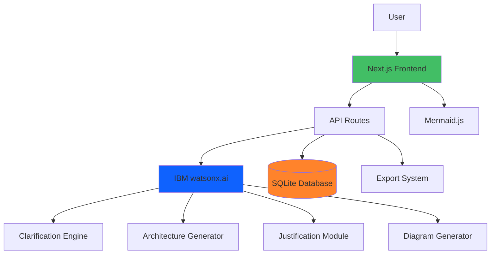

# AI-Powered System Design Assistant

This repository contains a Next.js application that turns a rough project idea into an AI-generated system design workflow powered by IBM watsonx.ai. The current app supports project creation, guided clarification, architecture option generation, architecture selection, Mermaid-based design visualization, implementation guide export, and saved project history backed by SQLite.

## What is implemented

- Create a project from a short product or system idea
- Run an AI clarification flow to shape the right design for the project
- Generate and persist multiple architecture options
- Select one architecture and review its diagram, component breakdown, justifications, and implementation guide
- Save project state and revisit it later from the history page
- Store data locally in SQLite at `data/app.db`

## Current app flow

1. Start at `/` and describe the project.
2. Answer the clarification questions.
3. Continue to `/project/[id]/architecture` to review generated options.
4. Select an option to open `/project/[id]/design`.
5. Revisit saved work at `/history`.

## 🏗️ Architecture



## Technology

- Next.js 14 App Router
- React 18
- TypeScript
- Tailwind CSS
- IBM watsonx.ai SDK
- Mermaid for architecture diagrams
- better-sqlite3 for local persistence
- Jest for test execution

## Prerequisites

- Node.js 18 or newer
- npm
- An IBM Cloud watsonx.ai project with API credentials

## Setup

1. Install dependencies.

```bash
npm install
```

2. Create `.env.local` in the project root.

```bash
WATSONX_API_KEY=your_api_key_here
WATSONX_PROJECT_ID=your_project_id_here
WATSONX_URL=https://us-south.ml.cloud.ibm.com
```

3. Start the development server.

```bash
npm run dev
```

4. Open `http://localhost:3000`.

The SQLite database is created automatically on first use. There is no working migration step required for local startup in the current codebase.

## Available scripts

```bash
npm run dev
npm run build
npm run start
npm run lint
npm test
npm run test:watch
npm run test:watsonx
```

## Project structure

```text
ibm_hackathon/
├── data/                  # Local SQLite database and other app data
├── public/                # Static assets
├── scripts/               # Utility scripts used during development
├── src/
│   ├── app/               # App Router pages and API routes
│   ├── components/        # UI and feature components
│   ├── lib/               # Database, watsonx, Mermaid, and utility code
│   ├── styles/            # Additional styling assets
│   └── types/             # Shared TypeScript types
├── README.md
└── package.json
```

## Key routes

- `/` - create a project and run the clarification flow
- `/history` - list saved projects and resume or delete them
- `/project/[id]/architecture` - review and select architecture options
- `/project/[id]/design` - inspect the selected architecture and generated design artifacts

## Key API routes

- `/api/projects` - create and list projects
- `/api/projects/[id]` - fetch or delete a project
- `/api/projects/[id]/conversations` - save clarification answers
- `/api/clarify` - get the next clarification question
- `/api/clarify/complete` - finalize captured requirements
- `/api/architecture/generate` - generate architecture options
- `/api/architecture/select` - mark the chosen architecture
- `/api/architecture/[id]/components` - generate or fetch component breakdown
- `/api/architecture/[id]/justifications` - generate or fetch architecture rationale
- `/api/architecture/[id]/implementation-guide` - generate or fetch implementation guidance
- `/api/diagrams/generate` - generate Mermaid diagrams for an architecture


## Troubleshooting

If the dev server starts but `http://localhost:3000` returns a `500` with a missing `.next/server/*.js` chunk, clear the local Next.js build output and restart the app:

```bash
rm -rf .next
npm run dev
```

## Additional documentation

These repo documents contain useful planning and deployment context:

- `ARCHITECTURE_PLAN.md`
- `TECHNICAL_SPEC.md`
- `IMPLEMENTATION_GUIDE.md`
- `SETUP_GUIDE.md`
- `IBM_CLOUD_DEPLOYMENT.md`
- `WATSONX_SETUP_GUIDE.md`
- `TROUBLESHOOTING.md`
