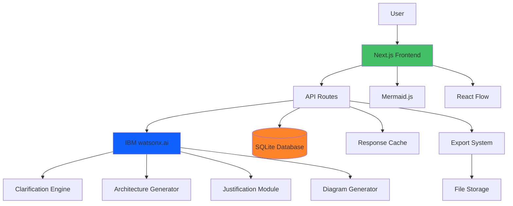

# AI-Powered System Design Assistant

An intelligent web application that transforms rough project ideas into structured, visualized software architectures using IBM watsonx.ai. The system guides developers through a conversational design process, adapting explanations to their skill level (Beginner, Intermediate, Advanced).

## 🎯 Project Overview

This application helps developers:
- **Refine vague ideas** through AI-powered clarifying questions
- **Explore architecture options** with pros, cons, and tradeoffs
- **Visualize system design** with interactive diagrams
- **Understand decisions** with skill-level appropriate explanations
- **Export documentation** in multiple formats

## ✨ Key Features

### 1. Intelligent Clarification Workflow
- AI-powered questioning using IBM watsonx.ai (Bob persona)
- Context-aware follow-up questions
- Skill-level adapted language
- Progress tracking through 5-7 targeted questions

### 2. Reference Projects (NEW)
- Add links to similar existing projects
- Specify what you like/dislike about them
- Identify features to emulate or avoid
- AI learns from your concrete examples
- Generates more personalized recommendations

### 2. Architecture Generation
- Multiple architecture options (2-3 distinct approaches)
- Technology stack recommendations
- Complexity ratings and cost estimates
- Pros/cons analysis for each option

### 3. Component Breakdown
- Detailed component specifications
- Dependency mapping
- Interface definitions
- Implementation complexity ratings
- Effort estimates

### 4. Interactive Visualization
- **Mermaid.js**: AI-generated text-based diagrams
- **React Flow**: Interactive drag-and-drop editing
- Multiple diagram types (architecture, sequence, entity, deployment)
- Export to PNG, SVG, or Mermaid syntax

### 5. Decision Justification
- Explains architectural choices
- Presents alternatives and tradeoffs
- Covers technology, scalability, security, cost, and maintenance
- Adapted to user's skill level

### 6. Project Persistence
- SQLite database for project history
- Session management
- Conversation history
- Architecture versioning

### 7. Export Functionality
- Markdown documentation
- PDF reports
- JSON data export
- Diagram images (PNG/SVG)
- Mermaid syntax

## 🏗️ Architecture



## 🛠️ Technology Stack

### Frontend
- **Framework**: Next.js 14+ (App Router)
- **Language**: TypeScript
- **Styling**: Tailwind CSS
- **Visualization**: Mermaid.js + React Flow
- **State Management**: React Context + Zustand

### Backend
- **Runtime**: Node.js (Next.js API Routes)
- **AI**: IBM watsonx.ai SDK
- **Database**: SQLite with better-sqlite3
- **Validation**: Zod

### Development
- **Package Manager**: npm/pnpm
- **Linting**: ESLint + Prettier
- **Testing**: Jest + React Testing Library

## 📋 Prerequisites

- Node.js 18 or higher
- IBM Cloud account with watsonx.ai access
- npm or pnpm package manager

## 🚀 Quick Start

### 1. Clone Repository

```bash
git clone https://github.com/yourusername/ibm_hackathon.git
cd ibm_hackathon
```

### 2. Install Dependencies

```bash
npm install
```

### 3. Set Up IBM watsonx.ai

Follow the detailed guide in [`WATSONX_SETUP_GUIDE.md`](./WATSONX_SETUP_GUIDE.md) to:
- Create IBM Cloud account
- Set up watsonx.ai service
- Obtain API credentials

### 4. Configure Environment

Create `.env.local` file:

```bash
# IBM watsonx.ai
WATSONX_API_KEY=your_api_key_here
WATSONX_URL=https://us-south.ml.cloud.ibm.com
WATSONX_PROJECT_ID=your_project_id_here

# Database
DATABASE_PATH=./data/projects.db

# Application
NODE_ENV=development
NEXT_PUBLIC_APP_URL=http://localhost:3000

# Export Storage
EXPORT_STORAGE_PATH=./exports
# Optional: GitHub API for reference project metadata
GITHUB_TOKEN=your_github_token_here
```

### 5. Initialize Database

```bash
npm run db:migrate
```

### 6. Start Development Server

```bash
npm run dev
```

Visit [http://localhost:3000](http://localhost:3000)

## 📖 Documentation

- **[Architecture Plan](./ARCHITECTURE_PLAN.md)**: Comprehensive system design and decisions
- **[Technical Specification](./TECHNICAL_SPEC.md)**: API design, data models, and implementation details
- **[watsonx.ai Setup Guide](./WATSONX_SETUP_GUIDE.md)**: Step-by-step IBM watsonx.ai configuration
- **[Implementation Guide](./IMPLEMENTATION_GUIDE.md)**: Detailed development instructions
- **[Reference Projects Feature](./FEATURE_REFERENCE_PROJECTS.md)**: Specification for similar project comparison

## 🎯 User Journey

### Phase 1: Idea Submission
1. User selects skill level (Beginner/Intermediate/Advanced)
2. Enters rough project idea
3. (Optional) Adds reference projects with likes/dislikes
4. Clicks "Start Design Process"

### Phase 2: Clarification
1. AI (Bob) asks clarifying questions
2. User responds to each question
3. AI adapts follow-ups based on responses
4. AI presents refined requirements summary
5. User confirms or requests changes

### Phase 3: Architecture Generation
1. AI generates 2-3 architecture options
2. Each option shows overview, tech stack, pros/cons
3. User reviews and selects preferred option

### Phase 4: Detailed Design
1. System shows detailed component breakdown
2. Interactive Mermaid diagram displayed
3. User can edit in React Flow
4. Justifications for decisions shown
5. Tradeoffs explained

### Phase 5: Export & Save
1. User reviews complete architecture
2. Exports in preferred format (MD, PDF, JSON, PNG)
3. Project saved to history
4. Can return to edit later

## 🧪 Testing

```bash
# Run unit tests
npm test

# Run integration tests
npm run test:integration

# Run E2E tests
npm run test:e2e

# Test watsonx.ai connection
npm run test:watsonx
```

## 📦 Project Structure

```
ibm_hackathon/
├── src/
│   ├── app/              # Next.js pages and API routes
│   ├── components/       # React components
│   ├── lib/             # Utility libraries
│   ├── types/           # TypeScript types
│   └── hooks/           # Custom React hooks
├── scripts/             # Utility scripts
├── data/               # Database files
├── exports/            # Generated exports
├── tests/              # Test files
└── docs/               # Documentation
```

## 🔒 Security

- API keys stored in environment variables
- Input validation with Zod schemas
- Rate limiting on API endpoints
- Content sanitization
- SQL injection prevention
- CORS configuration

## 🚀 Deployment

### Vercel (Recommended)

```bash
# Install Vercel CLI
npm i -g vercel

# Deploy
vercel
```

### Docker

```bash
# Build image
docker build -t system-design-assistant .

# Run container
docker run -p 3000:3000 --env-file .env.local system-design-assistant
```

### IBM Cloud

Follow IBM Cloud deployment guide for Next.js applications.

## 📊 Performance

- Page load time: < 2 seconds
- AI response time: < 5 seconds per question
- Diagram generation: < 3 seconds
- Export generation: < 5 seconds

## 🤝 Contributing

1. Fork the repository
2. Create feature branch (`git checkout -b feature/amazing-feature`)
3. Commit changes (`git commit -m 'Add amazing feature'`)
4. Push to branch (`git push origin feature/amazing-feature`)
5. Open Pull Request

## 📝 License

This project is licensed under the MIT License - see the [LICENSE](LICENSE) file for details.

## 🙏 Acknowledgments

- IBM watsonx.ai for AI capabilities
- Next.js team for the excellent framework
- Mermaid.js and React Flow for visualization tools
- Open source community

## 📧 Support

For issues and questions:
- Open an issue on GitHub
- Check [Documentation](./ARCHITECTURE_PLAN.md)
- Review [watsonx.ai Setup Guide](./WATSONX_SETUP_GUIDE.md)

## 🗺️ Roadmap

### Phase 1 (Current)
- ✅ Core clarification workflow
- ✅ Architecture generation
- ✅ Basic visualization
- ✅ Export functionality

### Phase 2 (Planned)
- [ ] User authentication
- [ ] Team collaboration
- [ ] Template library
- [ ] Version control for architectures

### Phase 3 (Future)
- [ ] Code generation from architecture
- [ ] Cost estimation calculator
- [ ] Security vulnerability scanning
- [ ] Performance prediction

### Phase 4 (Vision)
- [ ] AI-powered code review
- [ ] Automated testing strategy
- [ ] Deployment pipeline recommendations
- [ ] Multi-language support

## 📈 Success Metrics

- Time from idea to architecture: < 10 minutes
- User satisfaction: > 4/5 stars
- Completion rate: > 80% of started sessions
- Architecture relevance: Validated by expert review

---

Built with ❤️ for IBM Hackathon using IBM watsonx.ai
